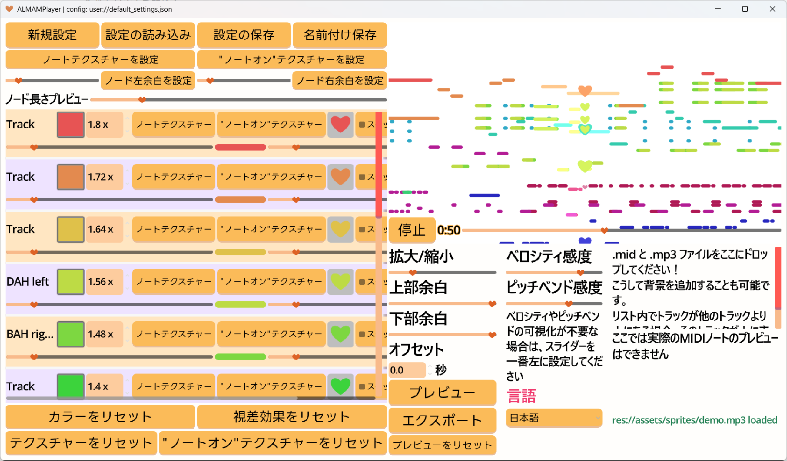

# ALMAM Player

[ALMAMPlayer](https://github.com/almam72/ALMAMPlayer) をベースに開発した MIDI ビジュアライザです。

Godot 4.6 を使用して制作しました。

> ⚠️ ソースコードの保守が困難と判断し、本プロジェクト（fork ver.）の開発を終了いたしました。

## ダウンロード

https://github.com/icysamon/almam-player/releases

初めて起動した場合 MIDI トラックがおかしくなる可能性があります。その場合アプリを**再起動**してください。

> MIDI とオーディオファイルをインポート後 `プレビューをリセット` ボタンを押してください。

